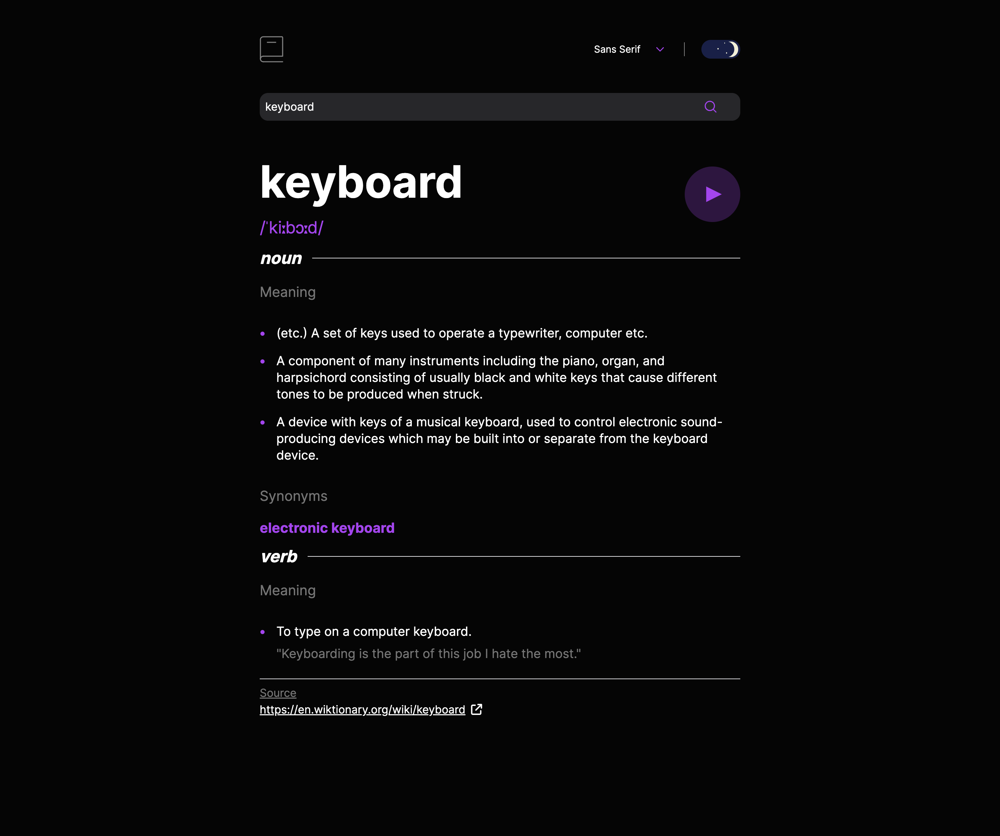

# Frontend Mentor - Dictionary web app solution

This is a solution to the [Dictionary web app challenge on Frontend Mentor](https://www.frontendmentor.io/challenges/dictionary-web-app-h5wwnyuKFL). Frontend Mentor challenges help you improve your coding skills by building realistic projects. 

## Table of contents

- [Overview](#overview)
  - [The challenge](#the-challenge)
  - [Screenshot](#screenshot)
  - [Links](#links)
- [My process](#my-process)
  - [Built with](#built-with)
  - [What I learned](#what-i-learned)
  - [Continued development](#continued-development)
- [Author](#author)


### Screenshot





### Links

- Solution URL: [Github repo](https://github.com/filecc/FM-dictionary-web-app)
- Live Site URL: [Live Site](https://filecc.github.io/FM-dictionary-web-app/)

## My process

### Built with

- Semantic HTML5 markup
- CSS custom properties
- Flexbox
- CSS Grid
- Mobile-first workflow
- [Tailwind](https://tailwindcss.com/) - CSS Framework
- Vanilla JS


### What I learned

Very proud of my dark mode toggle (even if does not match the design). 


🥹🥰

And as usual, a must have, without this I cant reach this result. 

```js
/* Creates a new HTML element with an object in input */
export function createChild(props = {}) {
  let newElement;
  Object.entries(props).forEach(([key, value]) => {
    switch (key) {
      case "tag":
        newElement = document.createElement(value);
        break;
      case "id":
        newElement.setAttribute("id", value);
        break;
      case "classes":
        addClasses(newElement, value);
        break;
      case "text":
        newElement.textContent = value;
        break;
      default:
        newElement.setAttribute(key, value);
        break;
    }
    /* Add the specified classes to the given HTML element */
    function addClasses(element, classes) {
      classes.forEach((_class) => element.classList.add(_class));
    }
  });

  return newElement;
}
```


### Continued development

Next step: maybe trying to build the same web app, with a Javascript Framework, maybe Vue or React. 

## Author

- Website - [filecc](https://www.filecc.dev)
- Instagram - [Instagram](https://www.instagram.com/filecc)
- Frontend Mentor - [@filecc](https://www.frontendmentor.io/profile/filecc)
- Twitter - [@_filecc](https://www.twitter.com/_filecc)

